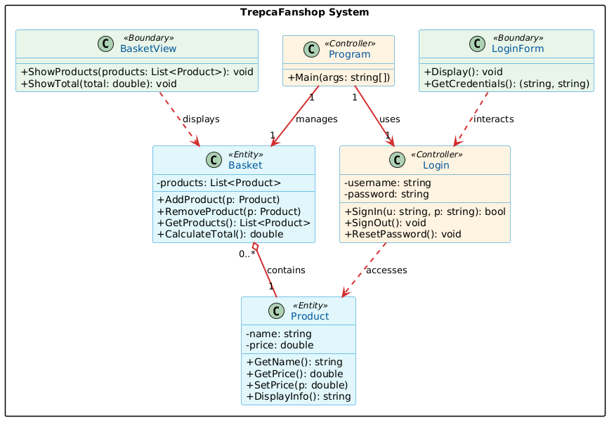

# Arkitektura e Projektit: TrepcaFanshop (Avancuar)

Ky dokument përshkruan **arkitekturën e projektit TrepcaFanshop**, duke përfshirë shtresat, përgjegjësitë, marrëdhëniet midis komponentëve, dhe arsyet profesionale të vendimeve.  
Ky nivel i detajuar është krijuar për **qartësi, modularitet, mirëmbajtje, testim dhe shkallëzim të lehtë**.

---

## 1. Diagram Vizual i Klasave

  

- **Ngjyra sipas shtresave:**  
  - Light Blue → Entities (`Product`, `Basket`)  
  - Light Green → Controllers (`Program`, `Login`)  
  - Light Yellow → UI / Boundaries (`LoginForm`, `BasketView`)  

- **Stereotypes:** Tregon rolin e klasës (`Entity`, `Controller`, `Boundary`)  

- **Relacione kryesore:**  
  - `Basket` → përmban `Product` (composition)  
  - `Program` → përdor `Login` dhe menaxhon `Basket`  
  - `UI` → ndërvepron me `Services` dhe `Repositories`  

---

## 2. Shtresat e Projektit

### 2.1 Models / Entities
- Përmban **entitetet e biznesit**: `Product` dhe `Basket`  
- **Atributet kryesore:**  
  - `Product`: Id, Name, Price  
  - `Basket`: Id, List<Product>  

- **Përgjegjësi:**
  - Ruajnë strukturën e të dhënave  
  - Nuk përmbajnë logjikë të avancuar biznesi ose UI  

- **Përfitim profesional:**  
  Entitetet janë të pavarura dhe mund të përdoren në çdo shtresë pa krijuar varësi të panevojshme.

---

### 2.2 Data / Repositories
- Implementon **Repository Pattern** për menaxhimin e të dhënave  

#### Komponentët:
- `IRepository<T>`  
  - Definon operacionet bazë:  
    `GetAll()`, `GetById()`, `Add()`, `Save()`

- `FileRepository<T>`  
  - Implementim gjenerik për çdo entitet  
  - **Ruajtje dhe lexim nga file CSV**  
  - Çdo entitet ruhet në file të veçantë:
    - `Product.csv`
    - `Basket.csv`

#### Karakteristika të avancuara:
- Përdor **reflection** për:
  - Gjenerimin automatik të kolonave  
  - Mapimin e të dhënave nga CSV në objekte  

- **Persistencë reale e të dhënave** pa databazë  

#### Përgjegjësi:
- Menaxhimi i të dhënave (CRUD)  
- Abstragimi i burimit të të dhënave  

#### Përfitim profesional:
- Mundëson ndërrimin e burimit të të dhënave (CSV → Database) pa ndryshuar pjesët tjera të sistemit  
- Rrit fleksibilitetin dhe testueshmërinë  

---

### 2.3 Services
- Përmban logjikën e biznesit: `Login`  

#### Përgjegjësi:
- Implementon rregullat e biznesit  
- Përdor `IRepository<T>` për qasje në të dhëna  

#### Shembull:
- `SignIn(username, password)` → verifikon përdoruesin  

#### Përfitim profesional:
- Ndarja e logjikës së biznesit nga Data dhe UI  
- Lehtëson testimin dhe mirëmbajtjen  

---

### 2.4 UI / Boundary
- Përmban klasat e ndërfaqes:  
  - `Menu`  
  - `LoginForm`  
  - `BasketView`  

#### Përgjegjësi:
- Shfaqja e të dhënave  
- Marrja e input-it nga përdoruesi  

#### Karakteristikë kryesore:
- Nuk përmban logjikë biznesi  

#### Përfitim profesional:
- Modularitet i lartë  
- Mundësi për ndryshim të UI pa ndikuar në logjikën e sistemit  

---

### 2.5 Program.cs (Entry Point)
- Shërben si **pika hyrëse e aplikacionit**  

#### Karakteristika:
- Përmban vetëm **inicializim të komponentëve**  
- Nuk përmban logjikë biznesi  

---
#### Aplikimi i parimeve SOLID
- **S – Single Responsibility Principle (SRP):** Çdo klasë ka një përgjegjësi të vetme. (`Product`, `Basket`, `Login`)  
- **O – Open/Closed Principle (OCP):** `FileRepository<T>` mund të zgjerohen për entitete të reja pa modifikuar bazën.  
- **L – Liskov Substitution Principle (LSP):** `BasketRepository` dhe `ProductRepository` trashëgojnë `FileRepository<T>` dhe mund të zëvendësojnë bazën pa thyer logjikën.  
- **I – Interface Segregation Principle (ISP):** `IRepository<T>` ka vetëm metodat e nevojshme për CRUD.  
- **D – Dependency Inversion Principle (DIP):** `Services` varen nga interfaces (`IRepository<T>`) dhe jo nga implementime konkrete (`FileRepository`).

---
#### Shembull:
```csharp
var productRepo = new ProductRepository();
var basketRepo = new BasketRepository();
new Menu(productRepo, basketRepo).Start();


